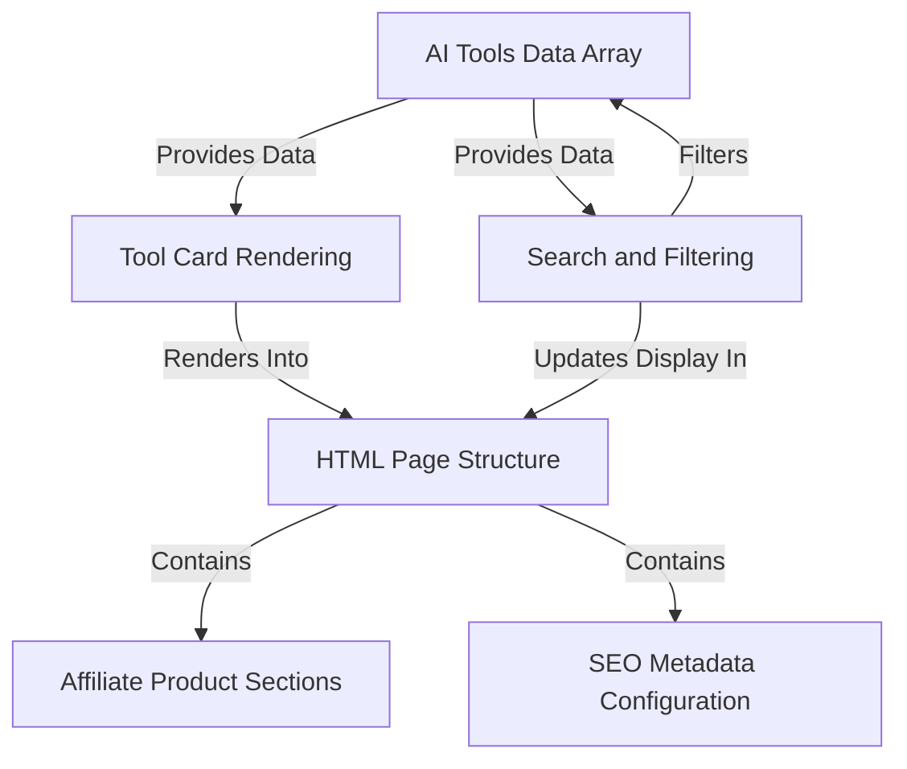

# 🧠 AI Tools Directory

A beautifully designed AI tools aggregator that helps users **search, discover, and compare 100+ AI applications** across different domains like writing, design, video editing, code generation, marketing, and more.

## 🌟 Features

- 🔍 **Smart Search** – Quickly find tools by category or name.
- 📊 **Compare Tools** – Get side-by-side comparisons of features and pricing.
- 🤑 **Affiliate Ready** – Integrates affiliate links for monetization.
- 📈 **SEO Optimized** – Meta tags, Open Graph, Twitter cards included.
- 🎨 **Responsive UI** – Built with Tailwind CSS for mobile-first design.
- 🧠 **Powered by LocalStorage** – Like/view counters stored in browser.
- ⚙️ **Easy Integration** – Lightweight and deployable on GitHub Pages.

## 🌐 Live Demo

👉 [Visit Live Site](https://santanu-p.github.io/ai-tools/)

## 📸 Preview

## 🛠️ Tech Stack

- HTML5 + Tailwind CSS
- JavaScript (Vanilla)
- GitHub Pages (Hosting)
- LocalStorage API

---

## 📩 Contribute or Suggest Tools

We welcome contributions! Submit a PR or open an issue to suggest new tools or improvements.

## License

This project is **not open source**. All rights reserved.

Do not copy, use, or distribute this code without explicit written permission from the author.

# Tutorial: ai-tools

This project is an *online directory* designed to help users **discover and compare different AI tools**.
It uses a **central list of tool data** to dynamically **display visual cards** for each tool.
Users can easily **search and filter** this list to find specific tools.
The site's **basic page layout** includes dedicated **sections for affiliate products** and is configured with **metadata for search engines**.

## Visual Overview

## Chapters

1. [HTML Page Structure
](01_html_page_structure_.md)
2. [Tool Card Rendering
](02_tool_card_rendering_.md)
3. [AI Tools Data Array
](03_ai_tools_data_array_.md)
4. [Search and Filtering
](04_search_and_filtering_.md)
5. [Affiliate Product Sections
](05_affiliate_product_sections_.md)
6. [SEO Metadata Configuration
](06_seo_metadata_configuration_.md)

---

Generated by [AI Codebase Knowledge Builder](https://github.com/The-Pocket/Tutorial-Codebase-Knowledge).
